<div align="center">

# 🧬 adRAG

### A multi-stage RAG pipeline that plans its own retrieval, searches three stores at once, and grades its own answer before returning it.

<br>

[](Backend/pyproject.toml)
[](Frontend/package.json)
[](https://www.python.org/)
[](https://flask.palletsprojects.com/)
[](https://langchain-ai.github.io/langgraph/)

[](https://vuejs.org/)
[](https://tailwindcss.com/)
[](#%EF%B8%8F-10-configuration)
[](#44-the-seam-between-them)
[](#)

</div>

<br>

---

<br>

## Content Tree

<pre>
adRAG
│
├── <a href="#-1-overview">📖 1. Overview</a>
│
├── <a href="#-2-features">✨ 2. Features</a>
│
├── <a href="#-3-the-rag-system">🧠 3. The RAG system</a>
│   ├── <a href="#31-the-eight-nodes-end-to-end">3.1 The eight nodes end to end</a>
│   ├── <a href="#32-the-planner-decides-whether-to-retrieve-at-all">3.2 The planner decides whether to retrieve at all</a>
│   ├── <a href="#33-three-stores-answer-the-same-query">3.3 Three stores answer the same query</a>
│   ├── <a href="#34-merge-then-rerank">3.4 Merge then rerank</a>
│   ├── <a href="#35-compression-is-the-exception-not-the-rule">3.5 Compression is the exception not the rule</a>
│   ├── <a href="#36-the-cited-answer">3.6 The cited answer</a>
│   ├── <a href="#37-the-self-reflection-loop">3.7 The self-reflection loop</a>
│   └── <a href="#38-what-a-retry-can-and-cannot-change">3.8 What a retry can and cannot change</a>
│
├── <a href="#%EF%B8%8F-4-the-system-end-to-end">🏗️ 4. The system end to end</a>
│   ├── <a href="#41-system-architecture">4.1 System architecture</a>
│   ├── <a href="#42-the-backend-half">4.2 The backend half</a>
│   ├── <a href="#43-the-frontend-half">4.3 The frontend half</a>
│   └── <a href="#44-the-seam-between-them">4.4 The seam between them</a>
│
├── <a href="#%EF%B8%8F-5-tech-stack">🛠️ 5. Tech stack</a>
│
├── <a href="#-6-project-structure">📁 6. Project structure</a>
│
├── <a href="#-7-getting-started">🚀 7. Getting started</a>
│   ├── <a href="#71-prerequisites">7.1 Prerequisites</a>
│   ├── <a href="#72-run-the-backend">7.2 Run the backend</a>
│   ├── <a href="#73-run-the-frontend">7.3 Run the frontend</a>
│   ├── <a href="#74-run-both-halves-at-once">7.4 Run both halves at once</a>
│   └── <a href="#75-your-first-query">7.5 Your first query</a>
│
├── <a href="#-8-usage">💡 8. Usage</a>
│
├── <a href="#-9-api">🔌 9. API</a>
│
├── <a href="#%EF%B8%8F-10-configuration">⚙️ 10. Configuration</a>
│
├── <a href="#%EF%B8%8F-11-known-gaps">⚠️ 11. Known gaps</a>
│
├── <a href="#-12-documentation">📚 12. Documentation</a>
│
└── <a href="#%EF%B8%8F-13-roadmap">🗺️ 13. Roadmap</a>
</pre>

<br>

---

<br>

## 📖 1. OVERVIEW

**adRAG** is a Retrieval-Augmented Generation system built around the idea that one similarity search
is not enough. It runs an **eight-node LangGraph pipeline** that decides whether retrieval is needed at
all, queries **three different stores** over the same corpus, reranks the merged evidence with a
cross-encoder, and then runs a **second LLM as a critic** that reads the answer back against the
evidence and can send the whole thing round again.

It ships as two independently runnable halves:

- **Backend** — a Flask REST + Server-Sent Events API wrapped around the pipeline. It ingests
  documents, retrieves, reranks, compresses, generates a cited answer, and verifies the answer's
  grounding before returning it.
- **Frontend** — a Vue 3 single-page app that drives the pipeline and renders its progress live from
  the SSE stream: chat, knowledge-base management, and provider configuration.

The problem it targets is the one every naive RAG system hits. A single vector search returns
plausible-looking chunks; the model answers from them whether or not they support the claim; and
nobody can tell where the answer came from. adRAG attacks that from three sides — it retrieves the
same corpus three different ways so keyword-exact and entity-linked evidence survives alongside
semantic matches, it reranks the merged pool with a model that reads the query and the passage
*together*, and it re-reads its own answer against the evidence before shipping it.

> [!NOTE]
> Everything runs locally against your own documents. The LLM is either **OpenAI** or a local
> **Ollama** server, chosen per request, and web search (DuckDuckGo) is optional and needs no API key.
> Nothing but the LLM call leaves the machine.

> [!CAUTION]
> **This is a localhost project as it stands.** There is no authentication on any route,
> `DELETE /api/clear` wipes the whole index in one unauthenticated request, the CORS allowlist ends in
> a literal `"*"`, and `FLASK_DEBUG` defaults to `true`. See [§11](#%EF%B8%8F-11-known-gaps) and
> [`Backend/Documentation/security.md`](Backend/Documentation/security.md) before exposing the port.

<br>

---

<br>

## ✨ 2. FEATURES

- 🧭 **A Self-RAG planner** — an LLM decision node runs *first* and decides whether the knowledge base
  should be searched at all, whether to reach for web search, and what kind of question this is. A
  greeting or a general-knowledge question never touches the corpus.
- 🔍 **Hybrid retrieval over three stores** — a dense vector index (ChromaDB by default, FAISS opt-in),
  a BM25 keyword index, and a NetworkX entity graph, all queried on every retrieval pass.
- 🎯 **Cross-encoder reranking** — `cross-encoder/ms-marco-MiniLM-L-6-v2` scores every
  `(query, passage)` pair and keeps the top five. It is the only place in the pipeline where a single
  comparable relevance number exists.
- 🗜️ **Threshold-triggered compression** — evidence passes through untouched below `MAX_CONTEXT_CHARS`
  (4000). Only above it does an LLM compression pass run, so the common case costs nothing.
- 🔁 **A bounded self-reflection loop** — a second LLM grades the answer for grounding, and a failed
  grade can send the pipeline back to retrieval up to `MAX_REFLECTION_RETRIES` (2) more times, for at
  most three passes total.
- 🌐 **Evidence-driven web escalation** — when a retry follows an empty or irrelevant knowledge-base
  hit, reflection turns DuckDuckGo search on for the next attempt.
- 📡 **Live pipeline streaming** — 31 emit sites across the eight nodes produce seven event types, and
  the route frames four more, so the UI shows the pipeline *working* rather than a spinner.
- 🧾 **Cited answers** — the generator emits inline `[1]`, `[2]` citations, and the source list is
  filtered down to the documents the model actually cited.
- 🔌 **Two LLM providers** — OpenAI or Ollama, selected per request, with a live availability probe and
  model list behind `GET /api/providers`. The API key never leaves the server; availability is reported
  as a boolean.
- 📚 **Knowledge-base management** — upload any of **35 file types** (up to 50 MB), see what is
  indexed, delete one knowledge base or clear everything. Re-uploading the same bytes replaces that
  document's data instead of duplicating it.

<br>

---

<br>

## 🧠 3. THE RAG SYSTEM

This is the part of the project everything else exists to serve. The full engineering treatment lives
in [`Backend/Documentation/rag-pipeline/`](Backend/Documentation/rag-pipeline/README.md); this section
is the working explanation.

### 3.1 The eight nodes end to end

The pipeline is a LangGraph state machine built in
`Backend/src/adrag/custom_packages/rag_pipeline/workflow.py` and compiled once into a module-level
`rag_graph` singleton. Eight nodes are registered, the entry point is `planner`, and **two of the edges
are conditional**.

<p align="center">
  
</p>

<sub>Diagram source: <a href=".readme-lib/readme/diagrams/mermaid-source/rag-pipeline-flow.mmd"><code>rag-pipeline-flow.mmd</code></a> — edit it, then regenerate the SVG (don't hand-edit the SVG).</sub>

| # | Node | What it contributes | LLM call? |
|---|---|---|---|
| 1 | `planner` | Decides `retrieve`, `use_external`, and a `query_type` label | ✅ |
| 2 | `retrieval` | Three store searches — vector, BM25, graph | ❌ |
| 3 | `external_tools` | DuckDuckGo web search; self-skips when not wanted | ❌ |
| 4 | `aggregate` | Concatenates all four result lists and deduplicates | ❌ |
| 5 | `rerank` | Cross-encoder scores every candidate; keeps the top 5 | ❌ (a local model) |
| 6 | `compress` | Shrinks the context — but only above the character threshold | conditional |
| 7 | `reason` | Writes the answer with inline citations | ✅ |
| 8 | `reflect` | Grades the answer, then either retries or terminates | ✅ |

The spine from `external_tools` onward is linear: `aggregate` → `rerank` → `compress` → `reason` →
`reflect`. **There is exactly one loop edge in the whole graph — `reflect` back to `retrieval`.**

> [!IMPORTANT]
> **`final_answer` is the termination signal, and it is the only one.** The reflection router
> (`_route_reflection`, `workflow.py:47`) tests `state["final_answer"]` for truthiness and nothing
> else — not `grounded`, not `retry_count`, not the retry budget. Any node that writes a non-empty
> `final_answer` ends the graph; any path that reaches `reflect` without one loops back to retrieval.
> The retry budget is enforced *inside* the reflection node, not by the router.

### 3.2 The planner decides whether to retrieve at all

The first node is a Self-RAG decision. The LLM is asked for JSON —
`{retrieve, use_external, query_type, reasoning}` — and the router reads the two booleans:

```python
# workflow.py:38
def _route_planner(state: RAGState) -> str:
    if state.get("retrieve", True):
        return "retrieval"
    if state.get("use_external", False):
        return "external_tools"
    return "aggregate"    # direct answer: skip all retrieval
```

`retrieve` is true for questions about your uploaded documents and false for general world knowledge,
maths, greetings, and coding questions. `use_external` is true only for recent events and live data.

Two consequences worth knowing:

- **On the `retrieve = true` path, `use_external` never reaches the router.** `retrieval` flows into
  `external_tools` on a static edge, and that node decides for itself whether to run — emitting a skip
  event when it does not. So web search still happens on that path if the planner asked for it.
- **The planner fails toward retrieval.** Any exception in the node returns
  `retrieve=True, use_external=False, query_type="factual"`, so an LLM hiccup degrades to a plain RAG
  query rather than an unsourced direct answer.

### 3.3 Three stores answer the same query

The retrieval node runs three searches over the same corpus. They find different things on purpose.

| Store | Library | What it finds | Width | Score scale |
|---|---|---|---|---|
| Dense vector | ChromaDB `PersistentClient`, cosine space (FAISS `IndexFlatIP` opt-in) | Semantic neighbours | `RETRIEVAL_TOP_K` = 10 | `1.0 - distance`, roughly 0–1 |
| Sparse keyword | `rank_bm25.BM25Okapi` over lower-cased `\b\w+\b` tokens | Exact terms and rare words | 10 | Raw BM25, **unbounded**, zero-scoring hits dropped |
| Entity graph | NetworkX bipartite document ↔ entity graph | Chunks linked to entities in the question | `max(10 // 2, 3)` = 5 | Traversal weight, **unbounded** |

Three details that shape how the system behaves:

- **The three searches are sequential, not parallel.** They are three ordinary function calls in one
  node — no thread pool, no `asyncio`.
- **Entity extraction is regex, not a model.** The graph store recognises multi-word capitalised proper
  nouns, 2–6 character acronyms, and camelCase identifiers, minus a 26-word stop list. First-hop
  documents score `edge_weight × 2.0`, second-hop documents `+0.5` per path. A lower-case question with
  no proper nouns yields nothing from the graph at all — the store returns an empty list immediately.
- **Web results, when enabled, carry a fixed score of `0.7`** and a hardcoded width of five.

> [!WARNING]
> **The `score` field is not comparable across stores.** A cosine similarity of `0.82`, a raw BM25
> score of `8.2`, and a graph traversal weight of `4.5` share one `float` field and mean three
> different things. **Only `rerank_score` is comparable** — never rank on `score`.

### 3.4 Merge then rerank

`aggregate` concatenates the four lists in a fixed order (vector, BM25, graph, web) and deduplicates by
the **MD5 of the chunk text**, keeping the highest-scoring copy. That is exact-string identity: a
near-duplicate, or the same passage chunked at a different offset, does not collapse.

`rerank` is where the incomparable scales are resolved. A cross-encoder reads each `(query, passage)`
pair *together* and emits one number on one scale; the node sorts on it and slices to `RERANK_TOP_K`
(5). That slice becomes the context every downstream node sees.

> [!IMPORTANT]
> **`rerank_score` is a raw logit, not a 0–1 probability, and negative values are meaningful** — the
> default ms-marco cross-encoder returns negative scores for pairs it considers irrelevant. That sign
> is load-bearing: the reflection node's web-escalation test is *"was the best passage scored below
> zero?"* Swap in a reranker with a non-negative output range and escalation silently stops firing.

The reranker is the pipeline's dominant local compute — one forward pass per candidate, and at the
defaults there are up to thirty of them (ten vector, ten BM25, five graph, five web) before dedup. If the model fails to load, the node falls back to sorting by the raw `score`
and keeps going; the answer still arrives, just ranked by an incomparable field.

### 3.5 Compression is the exception not the rule

`compress` assembles the surviving documents into numbered blocks — `[1] filename`, `[2] filename` —
and measures the total. Below `MAX_CONTEXT_CHARS` (4000) it returns that text **verbatim and makes no
LLM call at all**. At the defaults that is the common case: five chunks of 500 characters is about
2500. Only a long context triggers the compression prompt, and even then the model sees at most the
first 10 000 characters.

Those `[1]`, `[2]` labels are not decoration — they are the same 1-based ordering the answer generator
uses to build its source list, which is what makes the citations line up.

### 3.6 The cited answer

`reason` builds the source list *first*, one entry per context document, then asks the LLM for JSON:
`{answer, confidence, cited_sources, key_facts, is_sufficient}`. The prompt requires the answer to use
only the provided context and to carry inline `[n]` citations.

Then it filters:

```python
# reasoning.py:93
cited_indices = set(result.get("cited_sources", []))
cited_sources = [s for s in sources if s["index"] in cited_indices]
```

**Only sources the model explicitly cited survive into the response.** A retrieved-but-uncited document
is invisible in the UI, and an answer written from the model's own training knowledge comes back with
an empty `sources` array. That is normal behaviour, not a bug — and it is the mechanism behind "the
answer has no sources".

If there is no context at all — the planner's direct-answer path — the node takes a plain,
non-JSON branch and returns `sources: []` explicitly.

### 3.7 The self-reflection loop

Reflection is what separates this pipeline from a one-shot chain. A second LLM call, with the same
provider and the same temperature, receives the question, the retrieved context, and the answer, and
returns `{grounded, confidence, issues, feedback, should_retry}`.

A retry happens only when **all three** of these hold:

```python
# reflection.py:97
will_retry = (not grounded) and raw_retry and (retry_count < MAX_RETRIES)
```

1. the critic judged the answer **not grounded**;
2. the critic **also** asked for a retry — it can call an answer ungrounded and still decline to try
   again;
3. the budget is unspent — `MAX_REFLECTION_RETRIES` defaults to `2`, so **three passes maximum**.

**Escalation to the web is evidence-driven.** On a retry, if the knowledge base looked insufficient —
zero context documents, or a best `rerank_score` below zero — and web search was not already on,
reflection flips `use_external` to true so the next pass adds DuckDuckGo results. It is the only place
outside the planner that writes that flag.

When the budget runs out the answer is still returned, with a caveat line appended noting that some
claims may not be fully supported. And if reflection itself raises, it **fails open**: it marks the
answer grounded, sets `final_answer`, and terminates — a broken critic ends the run rather than
looping forever.

### 3.8 What a retry can and cannot change

This is the most important honest limit in the system, and it follows from three facts that are each
individually reasonable:

- Every LLM call uses `temperature=0`; no node overrides it.
- A node's returned keys **overwrite** rather than accumulate, so a second retrieval pass *replaces*
  the first pass's documents instead of adding to them.
- `reflection_feedback` is written on every reflection pass and **read by nothing**. The critique
  reaches the browser as the `reason` field of a `retry` event, but no prompt is changed by it.

Put together: a retry that does **not** escalate re-runs the identical query against the identical
corpus with the identical prompt at temperature zero — and so produces the same answer, which the
critic then judges the same way. **The retry budget can only change the outcome when escalation fires
and adds web documents.** Feeding the critique back into the next attempt, or raising the temperature
on a retry, are the two obvious ways to make the loop earn its cost; neither exists today.

<br>

---

<br>

## 🏗️ 4. THE SYSTEM END TO END

### 4.1 System architecture

The browser never talks to a store. The Vue SPA calls the Flask API, Flask runs the compiled pipeline
on a background thread, and every stage the pipeline enters is pushed back to the browser over one
long-lived SSE response.

<p align="center">
  
</p>

<sub>Diagram source: <a href=".readme-lib/readme/diagrams/mermaid-source/system-architecture.mmd"><code>system-architecture.mmd</code></a> — edit it, then regenerate the SVG (don't hand-edit the SVG).</sub>

| Piece | Where it runs | Responsibility |
|---|---|---|
| Vue 3 SPA | `localhost:8080` (dev server) | Four lazy routes, 13 components, three Pinia stores; renders the live pipeline |
| Dev proxy | Vue CLI dev server | Forwards `/api/*` to `http://localhost:5000`, so development has no cross-origin hop |
| Flask API | `0.0.0.0:5000`, threaded | Eight routes across four blueprints; owns upload, store access, and the SSE session |
| LangGraph pipeline | A daemon thread per query | The eight nodes, compiled once into `rag_graph` |
| Stores | On disk under `Backend/data/databases/` | Chroma (or FAISS), BM25, and the entity graph — each a process-wide singleton |
| LLM providers | The OpenAI API or a local Ollama server | Chosen per request; instances cached by provider, temperature, JSON mode, and model |

### 4.2 The backend half

A Flask application factory that carries **zero route decorators**. Every route lives in
`routes/<resource>/<resource>_routes.py` behind its own blueprint, and the factory registers them by
iterating one tuple:

```python
# adrag/app.py:51
for blueprint in BLUEPRINTS:
    app.register_blueprint(blueprint)
```

Adding an endpoint is a folder plus one line in `routes/__init__.py` — nothing in `app.py` changes.
Behind the routed layer sits `custom_packages/rag_pipeline/`, the capability nothing routes to: it
never imports Flask, never imports upward into `app.py`, and reaches the browser only through the
event bus.

> [!IMPORTANT]
> **The server runs as exactly one process with one worker, and that is a correctness constraint.**
> The SSE session registry is a plain module-level dict and every store is a module singleton, so
> forking splits the event producer from its consumer *and* gives each worker a divergent BM25 corpus
> and graph. That is why development uses `threaded=True` and production uses gunicorn's `-w 1`.
> Concurrent *queries* are fine — each gets its own session, queue, and thread. Concurrent *ingest* is
> not: the stores are unsynchronised, and only the knowledge-base registry holds a lock.

### 4.3 The frontend half

A Vue 3 SPA built with **Vue CLI / webpack** (not Vite). Four lazily-imported routes, 13 components,
three Pinia stores in setup style, and two axios clients — each constructing its own instance.

The placement rules are deliberately different for the two kinds of thing, and both are load-bearing:
**components are placed by ownership** (a component used by one page lives under that page; it moves to
`shared/` only when a second page imports it), while **state and HTTP clients are flat by kind**
(`store/ragStore.js`, `services/kbApi.js` — the domain lives in the filename, not a directory).

Nothing points upward: no store imports a component, no service imports a store, and `shared/` never
imports `pages/`. There is exactly one accepted exception to *"components call store actions, not
services"* — the navigation bar imports the health check directly to drive its connection dot.

### 4.4 The seam between them

One `POST` opens a stream and the pipeline narrates itself down it.

- **The transport is `fetch` + `ReadableStream`, not `EventSource`.** `EventSource` is GET-only and the
  query has to be sent as a POST body, so the client reads the frames by hand — and therefore gets no
  automatic reconnection.
- **Each query gets a `uuid4` session id mapped to an unbounded `queue.Queue`.** The pipeline runs on a
  daemon thread and pushes into that queue; the HTTP response drains it with a **180-second per-event**
  timeout and closes on a `None` sentinel, sending a literal `stream_end` frame last.
- **Errors are in-band.** Only two failures produce an HTTP error status — a blank query and an unknown
  provider, both `400`, both before the stream opens. Once the response headers are on the wire the
  status is `200` forever, so a pipeline failure arrives as an `error` **event** on a successful
  response. A client that reads the status code to decide whether a query succeeded will report every
  failed run as a success.
- **A disconnect frees the socket, never the compute.** The daemon thread runs to completion
  regardless; the emit function is a deliberate no-op once its session is gone.

**Eleven event types reach the browser** — seven emitted by pipeline nodes and four framed by the route
(`done`, two shapes of `error`, and `stream_end`).

> [!WARNING]
> **An SSE `stage` id is not the graph node name — five of the eight differ.** The graph registers
> `aggregate`, `rerank`, `compress`, `reason`, `reflect`, but the frames those nodes emit carry
> `aggregator`, `reranker`, `compressor`, `reasoning`, `reflection`. Only `planner`, `retrieval` and
> `external_tools` coincide. The frontend's stage list must equal the **emitted** set, and an
> unrecognised stage id is dropped silently — no error, no console warning. Rename a node and nothing
> breaks; change an emitted `stage` literal and that tracker row stops updating forever.

<br>

---

<br>

## 🛠️ 5. TECH STACK

**Backend** — Python 3.10+ is a hard requirement, not a preference: PEP 604 unions (`str | None`) are
evaluated at runtime in module and signature scope and no file carries
`from __future__ import annotations`, so 3.9 fails at import. Dependencies live in
`Backend/pyproject.toml`; `requirements.txt` is a one-line `-e .` pointer.

| Role | Package | Minimum |
|---|---|---|
| Web API | `flask` · `flask-cors` | `>=3.0.0` · `>=4.0.0` |
| Config | `python-dotenv` | `>=1.0.0` |
| Pipeline | `langgraph` | `>=0.1.0` |
| LLM abstraction | `langchain` · `langchain-text-splitters` · `langchain-community` | `>=0.2.0` (each) |
| Provider bindings | `langchain-openai` · `langchain-ollama` | `>=0.1.0` (each) |
| Dense vector store | `chromadb` (default) · `faiss-cpu` (`faiss` extra) | `>=0.5.0` · `>=1.7.4` |
| Embeddings + reranking | `sentence-transformers` | `>=3.0.0` |
| Sparse retrieval | `rank-bm25` | `>=0.2.2` |
| Knowledge graph | `networkx` | `>=3.3` |
| Document loaders | `pypdf` · `docx2txt` · `unstructured` · `markdown` | `>=4.0.0` · `>=0.8` · `>=0.14.0` · `>=3.6` |
| Web search | `ddgs` | `>=7.0.0` |
| Utilities | `numpy` · `requests` | `>=1.26.0` · `>=2.31.0` |
| Production server (`prod` extra) | `gunicorn` · `gevent-websocket` | `>=21.0.0` · `>=0.10.1` |

**Frontend** — Vue CLI 5 / webpack, from `Frontend/package.json`. Node.js 18 or newer is what the
toolchain expects; nothing in the manifest pins an engine.

| Role | Package | Version |
|---|---|---|
| Framework | `vue` | `^3.4.0` |
| Routing | `vue-router` | `^4.6.4` |
| State | `pinia` | `^2.1.7` |
| HTTP | `axios` | `^1.7.0` |
| Markdown rendering | `marked` | `^12.0.0` |
| Build | `@vue/cli-service` · `@vue/cli-plugin-babel` | `^5.0.8` (each) |
| Linting | `eslint` · `eslint-plugin-vue` · `@vue/cli-plugin-eslint` | `^8.57.0` · `^9.27.0` · `^5.0.8` |
| Styling | `tailwindcss` · `postcss` · `autoprefixer` | `^3.4.0` · `^8.4.0` · `^10.4.0` |
| Doc tooling (dev only) | `@mermaid-js/mermaid-cli` · `svgo` | `^11.16.0` · `^4.0.2` |

The last row is **documentation tooling, not application code** — it renders the `.mmd` sources under
`.readme-lib/` into the committed SVGs these docs embed. Nothing in `Frontend/src/` imports either.

**Models** — every default is overridable by environment variable:

| Purpose | Default | Variable |
|---|---|---|
| OpenAI chat model | `gpt-4o-mini` | `LLM_MODEL` |
| Ollama chat model | `llama3.2` (server at `http://localhost:11434`) | `OLLAMA_MODEL` |
| Embeddings | `all-MiniLM-L6-v2` | `EMBEDDING_MODEL` |
| Reranker | `cross-encoder/ms-marco-MiniLM-L-6-v2` | `RERANKER_MODEL` |

<br>

---

<br>

## 📁 6. PROJECT STRUCTURE

```text
Advanced RAG System/
│
├── 📁 Backend/                        Flask + LangGraph RAG API (Python)
│   ├── 📁 Documentation/              18 pages — the backend cookbook
│   ├── 📁 data/                       Runtime state — git-ignored, made on first run
│   ├── 📁 src/adrag/                  The installable package; the import root
│   ├── 📄 .env.example                Backend env template — copy to .env
│   ├── 📄 pyproject.toml              The manifest — deps, extras, adrag-dev
│   ├── 📄 README.md                   Backend front door
│   └── 📄 requirements.txt            A one-line `-e .` pointer, nothing more
│
├── 📁 Frontend/                       Vue 3 SPA (Vue CLI / webpack)
│   ├── 📁 Documentation/              8 pages — the frontend cookbook
│   ├── 📁 design/                     Design source — brand workbench + theme lab
│   ├── 📁 public/                     Served verbatim — build template, brand, icons
│   ├── 📁 src/                        App source — components placed by ownership
│   ├── 📄 .env.example                VUE_APP_API_URL — leave it unset in dev
│   ├── 📄 package.json                Three scripts: serve · build · lint
│   ├── 📄 README.md                   Frontend front door
│   ├── 📄 tailwind.config.js          Two font families; reads nothing from design/
│   └── 📄 vue.config.js               Dev server :8080 + /api proxy → :5000
│
├── 📁 infra/                          Repo-level tooling
│   ├── 📄 dev.py                      Runs both halves — python infra/dev.py
│   └── 📄 smoke.py                    Drives the read-only routes in-process
│
├── 📁 .readme-lib/                    Doc assets — diagram sources and renders
│
├── 📄 .gitignore                      Ignored paths — data, secrets, build output
└── 📄 README.md                       You are here
```

Runtime data lives under `Backend/data/` — `uploads/` for the original files, `databases/` for the
three stores and the knowledge-base registry. It does not exist in a fresh checkout: the backend
creates it at import time, and it is git-ignored.

> [!IMPORTANT]
> **`DATA_ROOT` is anchored to the package, not to the working directory.** `config.py` computes the
> backend root from `__file__` and defaults every data path against it, so where you start the server
> no longer decides where the databases land. A **relative** `DATA_ROOT` set in `.env` *is* resolved
> against the working directory, which reintroduces the bug — use an absolute path if you set one at
> all. This is also why `.env.example` ships its whole storage block commented out.

<br>

---

<br>

## 🚀 7. GETTING STARTED

The two halves run independently. Start the backend first; the frontend dev server proxies to it.

### 7.1 Prerequisites

| Requirement | Why |
|---|---|
| **Python 3.10+** | PEP 604 `X \| Y` unions are evaluated at runtime, with no `__future__` import |
| **Node.js 18+** | What Vue CLI 5 expects; no engine is pinned in the manifest |
| **An OpenAI API key** *or* **a running Ollama server** | The pipeline needs at least one working provider |

Ollama, if you use it, is expected at `http://localhost:11434`. Web search needs no key.

```bash
git clone git@github.com:Shohrab-Hossain/Advanced-RAG-System.git
cd Advanced-RAG-System
```

### 7.2 Run the backend

```bash
cd Backend
python -m venv .venv
```

Activate the environment — `.venv\Scripts\activate` on Windows, `source .venv/bin/activate` on macOS
and Linux — then install and configure:

```bash
pip install -e .
cp .env.example .env
```

Open `.env` and set your key:

```bash
OPENAI_API_KEY=<YOUR_API_KEY>
```

Then start it:

```bash
adrag-dev
```

`adrag-dev` is the console script `pip` installs; `python -m adrag.main` does the same thing without it
on `PATH`. The API listens on `0.0.0.0:5000` with threading enabled. Confirm it is up:

```bash
curl http://localhost:5000/api/health
```

```json
{ "status": "healthy" }
```

> [!NOTE]
> **First boot is slow — around a minute on a cold filesystem, roughly ten seconds warm.** Almost all
> of it is `sentence-transformers` pulling in torch at import. `/api/health` answers *before* the
> models finish loading, deliberately: it is a liveness probe, not a readiness one.

Two optional dependency groups exist, neither installed by default:

```bash
pip install -e ".[faiss]"    # faiss-cpu — only for VECTOR_BACKEND=faiss
pip install -e ".[prod]"     # gunicorn + gevent-websocket
```

For production, one worker, always — the `-w 1` and the worker class are both part of the command:

```bash
gunicorn -w 1 -k geventwebsocket.gunicorn.workers.GeventWebSocketWorker \
         --bind 0.0.0.0:5000 adrag.app:app
```

### 7.3 Run the frontend

In a second terminal:

```bash
cd Frontend
npm install
npm run serve
```

The dev server comes up on `http://localhost:8080` and proxies `/api` to `http://localhost:5000` with
`changeOrigin` set, so development needs no CORS configuration. `npm run build` produces a static
bundle in `dist/`.

> [!WARNING]
> **`Frontend/.env.example` ships `VUE_APP_API_URL` set, and its own comment tells you to leave it
> unset.** Copy the file verbatim and every call bypasses the dev proxy and goes cross-origin to
> `:5000` directly. Leave the variable unset (or empty) for normal development — both clients then fall
> back to a relative base URL, which is what the proxy is for. Set it only when the SPA is genuinely
> served from a different origin than the API.

> [!TIP]
> `npm run lint` runs Vue CLI's linter with **`--fix` on by default**, so invoking it to *check* the
> code rewrites it. Use `npm run lint -- --no-fix` when you only want the report.

### 7.4 Run both halves at once

From the repository root:

```bash
python infra/dev.py
```

It picks free ports (walking up from 5000 and 8080), injects them into the backend's environment,
points the frontend proxy at whichever port the backend actually got, waits on `/api/health`, and
prefixes each child's output. Four flags:

| Flag | Effect |
|---|---|
| `--direct` | The frontend calls the backend cross-origin instead of via the dev proxy |
| `--no-reload` | Disables the Flask reloader, so the models load once instead of twice |
| `--api-port <n>` | Pins the backend port instead of probing |
| `--ui-port <n>` | Pins the frontend port instead of probing |

### 7.5 Your first query

1. Open `http://localhost:8080` and go to **Knowledge Base**.
2. Upload a document — PDF, DOCX, Markdown, HTML, CSV, plain text, or any of 27 code extensions, up to
   50 MB. It is chunked at 500 characters with 50 of overlap and written to all three stores; the
   response reports the chunk, vector, entity, and edge counts.
3. Go to **Chat** and ask a question about it.
4. Watch the tracker. Each of the eight rows reports as its stage starts and finishes, the retrieval
   row shows per-store hit counts, and the answer arrives with numbered citations you can expand.

Uploading the same file again is safe. The knowledge-base id is the **MD5 of the file's contents**, and
indexing deletes that hash's data from all three stores before writing, so a re-upload is an idempotent
re-index rather than a duplicate — even under a different filename.

<br>

---

<br>

## 💡 8. USAGE

The SPA has four routes, all lazily loaded, in HTML5 history mode:

| Route | Page | What you do there |
|---|---|---|
| `/` | Home | The pitch and the entry point into the app |
| `/chat` | Chat | Ask questions, watch the live pipeline, read cited answers |
| `/knowledge-base` | Knowledge Base | Upload documents, review the index, delete one KB or clear all |
| `/configuration` | Configuration | Pick the provider and model; see which providers are reachable |

Chat history is kept in `localStorage` under the key `rag-chat-history`. Each entry stores a deep clone
of the pipeline's stage snapshot, so selecting one replays the whole tracker, not just the answer. The
**write** is capped at the newest 50 entries — the in-memory list is not, so a long session can show
more than 50 until the next reload trims it.

**Querying from the command line.** `POST /api/query` answers with an SSE stream, so pass `-N` to stop
curl from buffering:

```bash
curl -N -X POST http://localhost:5000/api/query \
  -H "Content-Type: application/json" \
  -d '{"query": "What does the reflection node check?", "provider": "openai"}'
```

Frames arrive as `data: <json>` blocks, each carrying a `type` and a `data` object — abridged:

```text
data: {"type": "stage_start", "data": {"stage": "planner", "message": "..."}}

data: {"type": "retrieval_result", "data": {"stage": "retrieval", "vector_count": 10, "bm25_count": 4, "graph_count": 3, "message": "..."}}

data: {"type": "stage_complete", "data": {"stage": "reranker", "top_k": 5, "scores": [4.71, 1.02], "message": "..."}}

data: {"type": "done", "data": {"answer": "...", "sources": [], "metadata": {}}}

data: {"type": "stream_end"}
```

`provider` is optional — omit it and `DEFAULT_PROVIDER` applies. `model` is optional too, and it
overrides the chat model for **either** provider, not just Ollama. The full event vocabulary, with
every payload key, is in
[`Backend/Documentation/api/query.md`](Backend/Documentation/api/query.md).

<br>

---

<br>

## 🔌 9. API

Eight routes, four blueprints, all under `/api`, none of them authenticated.

| Method | Path | What it does |
|---|---|---|
| `POST` | `/api/query` | Runs the pipeline and streams it back as `text/event-stream`. Body `{query, provider?, model?}`. `400` for a blank query or an unknown provider — the only HTTP error statuses in the flow. |
| `POST` | `/api/upload` | Multipart `file` upload; chunks and indexes into all three stores. `400` for a missing file, empty name, or disallowed extension; `422` when no text could be extracted; `500` on an indexing failure. |
| `GET` | `/api/documents` | Index counts — `{vector_count, bm25_count, graph}`. |
| `DELETE` | `/api/clear` | Wipes all three stores, the registry, **and** the uploaded files named by it. |
| `GET` | `/api/knowledge-bases` | Lists the indexed knowledge bases, newest first. |
| `DELETE` | `/api/knowledge-bases/<file_hash>` | Removes one knowledge base from all three stores. Idempotent — an unknown hash still returns `200`. |
| `GET` | `/api/providers` | Provider availability and model lists. Probes Ollama over the network, so it can block for up to ~10 s. |
| `GET` | `/api/health` | `{"status": "healthy"}` — one key. Liveness only; it answers while the models are still loading. |

> [!NOTE]
> **The JSON `{"error": …}` envelope only covers errors the application raises deliberately.** No
> error handler is registered anywhere, so `404`, `405`, `413` (an upload over 50 MB) and any unhandled
> `500` come back as Werkzeug's **HTML** pages. A client cannot assume `response.json().error` exists.

Full request and response shapes, every error, and the complete SSE catalogue live in
[`Backend/Documentation/api/`](Backend/Documentation/api/README.md).

<br>

---

<br>

## ⚙️ 10. CONFIGURATION

The backend reads `Backend/.env`, found by absolute path from the package location. Copy
`Backend/.env.example` and change what you need — everything has a working default except the OpenAI
key. **The process environment wins over `.env`**, which is exactly how `infra/dev.py` injects the
ports it picked.

| Variable | Default | Purpose |
|---|---|---|
| `OPENAI_API_KEY` | *(empty)* | Your OpenAI key. Empty means the OpenAI provider reports itself unavailable. |
| `LLM_MODEL` | `gpt-4o-mini` | OpenAI chat model |
| `OLLAMA_BASE_URL` | `http://localhost:11434` | Where the Ollama server lives |
| `OLLAMA_MODEL` | `llama3.2` | Ollama chat model |
| `DEFAULT_PROVIDER` | `openai` | Provider used when a request does not name one |
| `VECTOR_BACKEND` | `chroma` | `chroma` or `faiss`; `faiss` needs the `faiss` extra installed |
| `PORT` | `5000` | Backend listen port |
| `FRONTEND_URL` | `http://localhost:8080` | Added to the CORS origins list |
| `FLASK_DEBUG` | `true` | Turns on **both** the auto-reloader and the interactive debugger |

<details>
<summary><b>Full reference — pipeline tuning, paths, and the settings you cannot set</b></summary>

<br>

**Pipeline tuning**

| Variable | Default | Effect |
|---|---|---|
| `RETRIEVAL_TOP_K` | `10` | Candidates requested from each store (the graph gets `max(k // 2, 3)`) |
| `RERANK_TOP_K` | `5` | Documents kept after cross-encoder reranking |
| `MAX_CONTEXT_CHARS` | `4000` | Compression runs only above this total |
| `MAX_REFLECTION_RETRIES` | `2` | Extra attempts after a failed grounding check — three passes maximum |
| `EMBEDDING_MODEL` | `all-MiniLM-L6-v2` | The dense embedder |
| `RERANKER_MODEL` | `cross-encoder/ms-marco-MiniLM-L-6-v2` | The cross-encoder |
| `CHUNK_SIZE` | `500` | Characters per chunk at ingestion — **absent from `.env.example`** |
| `CHUNK_OVERLAP` | `50` | Overlap between adjacent chunks — **absent from `.env.example`** |

**Paths** — all derived from `DATA_ROOT`, which defaults to `Backend/data` computed from the package
location:

| Variable | Default |
|---|---|
| `DATA_ROOT` | `Backend/data` (absolute, package-anchored) |
| `UPLOAD_FOLDER` | `<DATA_ROOT>/uploads` |
| `DATABASE_ROOT` | `<DATA_ROOT>/databases` |
| `CHROMA_PATH` | `<DATABASE_ROOT>/vector_db/chroma_db` |
| `FAISS_PATH` | `<DATABASE_ROOT>/vector_db/faiss_db` |
| `BM25_PATH` | `<DATABASE_ROOT>/keyword_db/bm25_store/bm25_store.pkl` |
| `GRAPH_PATH` | `<DATABASE_ROOT>/graph_db/graph_store/graph_store.pkl` |
| `KB_REGISTRY_PATH` | `<DATABASE_ROOT>/kb_registry.json` — read directly by the registry module, not through `Config` |

The intermediate roots between `DATABASE_ROOT` and those four leaves read **no** environment variable,
so you can move the whole tree or an individual store file, but not one retrieval kind's folder.

**Two traps worth knowing.** `.env.example` documents the storage block with `${DATA_ROOT}`-style
references and ships it **entirely commented out** — uncomment a child without its parent and the
prefix expands to an empty string, so `UPLOAD_FOLDER` becomes the literal `/uploads` at the filesystem
root. And the debug flag's variable is **`FLASK_DEBUG`**, not `DEBUG`; setting `DEBUG=false` changes
nothing.

**Not configurable by environment**

| Setting | Value |
|---|---|
| Maximum upload size | 50 MB, enforced by Flask itself |
| Allowed extensions | 35, hardcoded in two places that must stay in step |
| Web search results per query | 5 |
| SSE per-event drain timeout | 180 seconds |
| LLM temperature | `0`, on every call |

**Frontend**

| Variable | Default |
|---|---|
| `VUE_APP_API_URL` | Unset in development — both clients fall back to a relative base URL and use the dev proxy. Only `VUE_APP_`-prefixed variables reach the browser, and the value is baked in **at build time**. |

</details>

The complete reference — every attribute, where it is cast, and the four ways the *"a setting is a
`Config` attribute and an `.env.example` line"* convention is broken — is in
[`Backend/Documentation/configuration.md`](Backend/Documentation/configuration.md).

<br>

---

<br>

## ⚠️ 11. KNOWN GAPS

The honest state of the repository. Two structural gaps, plus a set of security defaults that are fine
on localhost and nowhere else.

- **There is no test framework.** No runner appears in `Backend/pyproject.toml` or
  `Frontend/package.json`, there is no `tests/` directory, and there is no CI configuration.
  `infra/smoke.py` is a **dev tool and says so itself** — it builds the app through `create_app()` and
  drives the four read-only routes over Flask's test client, binding no port and writing nothing. It
  proves the import chain resolves and every blueprint is registered after a refactor. It is not a
  substitute for a harness, and **nothing here should be described as tested**.
- **There is no `LICENSE`.** No licence file exists at the root, so the terms for use, modification,
  and redistribution are formally undefined.

**Accepted, documented, localhost-only security risks.** Each is deliberate and each is a remote
compromise the moment the port is reachable off the machine:

| Risk | Where | Effect |
|---|---|---|
| No authentication on any route | every route | `DELETE /api/clear` wipes the whole index in one unauthenticated request |
| CORS allowlist ends in a literal `"*"` | the app factory | Any origin is accepted — the requesting origin is echoed back, and a cross-origin `DELETE` preflight succeeds |
| `FLASK_DEBUG` defaults to `true` | `config.py` | An unhandled error renders Werkzeug's traceback page with the interactive console enabled |
| Prompt input is unescaped by design | all four prompts | Query text, retrieved chunks and web results interpolate straight in — including into the critic that judges grounding |
| The answer renders through `marked` with no sanitiser | the result view | A crafted document is a stored-XSS path to every later reader |

The full treatment — the trust-boundary model, the measured wire behaviour, and an ordered checklist of
what to close first — is in
[`Backend/Documentation/security.md`](Backend/Documentation/security.md).

<br>

---

<br>

## 📚 12. DOCUMENTATION

This README is the front door. The engineering cookbook lives beside the code it describes, one tree
per half.

| Entry point | What is behind it |
|---|---|
| [`Backend/README.md`](Backend/README.md) | Backend front door — install, run, layout |
| [**`Backend/Documentation/`**](Backend/Documentation/README.md) | **18 pages** — the pipeline, the three stores, ingestion, the SSE bus, the LLM layer, the HTTP API, configuration, architecture, storage, security |
| [`Frontend/README.md`](Frontend/README.md) | Frontend front door — install, run, layout |
| [**`Frontend/Documentation/`**](Frontend/Documentation/README.md) | **8 pages** — the three stores, the API clients, the chat page and its tracker, the knowledge-base page, the configuration page, the design system |

**Where to go from here, by what you want to do:**

| If you want to… | Read |
|---|---|
| Understand the pipeline properly | [`rag-pipeline/README.md`](Backend/Documentation/rag-pipeline/README.md), then [`nodes.md`](Backend/Documentation/rag-pipeline/nodes.md) and [`state-model.md`](Backend/Documentation/rag-pipeline/state-model.md) |
| Understand retrieval quality | [`hybrid-retrieval/README.md`](Backend/Documentation/hybrid-retrieval/README.md) and [`stores.md`](Backend/Documentation/hybrid-retrieval/stores.md) |
| Call the API from your own client | [`api/README.md`](Backend/Documentation/api/README.md) and [`api/query.md`](Backend/Documentation/api/query.md) |
| Follow one request across every layer | [`architecture/query-lifecycle.md`](Backend/Documentation/architecture/query-lifecycle.md) |
| Know what is on disk and what survives a crash | [`architecture/storage-model.md`](Backend/Documentation/architecture/storage-model.md) |
| Add a document type or change chunking | [`ingestion/README.md`](Backend/Documentation/ingestion/README.md) |
| Work on the live tracker | [`chat/pipeline-tracker.md`](Frontend/Documentation/chat/pipeline-tracker.md) |
| Change styling or dark mode | [`design-system/README.md`](Frontend/Documentation/design-system/README.md) |
| Deploy this anywhere but localhost | [`security.md`](Backend/Documentation/security.md) — first |

<br>

---

<br>

## 🗺️ 13. ROADMAP

Where this goes next, in the order it makes sense to do it.

| # | Next step | What it unlocks |
|---|---|---|
| 1 | **Stand up a test harness** — a runner for each half and a first suite over the pipeline's routing, retry, and fallback paths. | Those paths can be verified instead of reasoned about, and `infra/smoke.py` can go back to being only a smoke check. |
| 2 | **Add a `LICENSE`.** | Makes the terms for use and contribution defined rather than absent. |
| 3 | **Close the localhost-only security defaults** — drop the `"*"` origin, default `FLASK_DEBUG` to false, add authentication, register JSON error handlers. | The first four are the prerequisites for this running anywhere with a reachable port. |
| 4 | **Make a retry able to change the answer** — feed the reflection critique into the next attempt, or vary temperature on a retry. | Today a non-escalating retry is deterministic and re-derives the same answer ([§3.8](#38-what-a-retry-can-and-cannot-change)). |
| 5 | **Give ingestion a real progress channel.** | Upload is fully synchronous with no job id and no stream, so the indexing bar in the UI is an animation rather than a measurement. |

<br>
